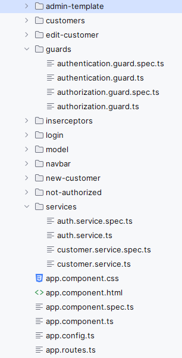
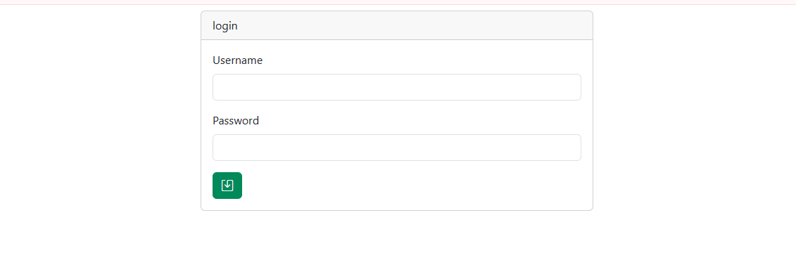

#  Digital Banking Application

A modern, comprehensive digital banking application built with **Angular 19** and **Spring Boot**, featuring JWT authentication, role-based access control, and responsive design.


##  Project Overview

This application provides a complete digital banking solution with customer management capabilities. The system implements secure authentication, role-based authorization, and comprehensive CRUD operations for managing bank customers and their accounts.
##  Project Structure
 

### Key Highlights
- **Frontend**: Angular 19 with TypeScript
- **Backend**: Spring Boot REST API
- **Authentication**: JWT-based security
- **Authorization**: Role-based access control (ADMIN/USER)
- **Responsive Design**: Bootstrap integration
- **Real-time Search**: Dynamic customer filtering

## Technologies Used

### Frontend
- **Angular**
- **TypeScript**
- **Bootstrap** (UI Framework)
- **Angular Router** (Navigation)
- **JWT Token Management**

##  Features

###  Authentication & Authorization
- **Secure Login System**: JWT token-based authentication
- **Role-Based Access Control**: 
  - **ADMIN**: Full CRUD operations (Create, Read, Update, Delete)
  - **USER**: Read-only access (View and Search only)
- **Token Management**: Automatic token storage and validation
- **Protected Routes**: Guard-based route protection

###  Customer Management
- **Complete CRUD Operations**:
  -  Add new customers
  -  Edit existing customer information
  -  Delete customers (Admin only)
  -  Search customers by keyword
  -  View  customer list
- **Real-time Search**: Instant filtering as you type
- **Form Validation**: Client-side and server-side validation

###  User Interface
- **Responsive Design**: Mobile-first approach with Bootstrap
- **Intuitive Navigation**: Clean, user-friendly interface
- **Loading States**: Proper loading indicators
- **Error Handling**: Comprehensive error messages
- **Role-based UI**: Dynamic UI elements based on user permissions


##  API Endpoints

### Authentication
- `POST /auth/login` - User authentication

### Customer Management
- `GET /customers` - Get all customers
- `GET /customers/search?keyword={keyword}` - Search customers
- `POST /customers` - Create new customer (Admin only)
- `PUT /customers/{id}` - Update customer (Admin only)
- `DELETE /customers/{id}` - Delete customer (Admin only)
- `GET /customers/{id}` - Get customer by ID

##  Security Features

### JWT Authentication
```typescript
// Token management in AuthService
 loadProfile(data :any){
    this.isAuthenticated=true;
   this.accessToken=data['access-token'];
let decodedJwt:any= jwtDecode(this.accessToken);
this.username=decodedJwt.sub;
this.roles=decodedJwt.scope;
console.log("Decoded JWT:", decodedJwt);
window.localStorage.setItem("jwt-yoken",this.accessToken);
    }
```


##  Application Screenshots

###  Login Page
 

###  Customer Management (Admin View)
 


###  Customer List (User View)

 


